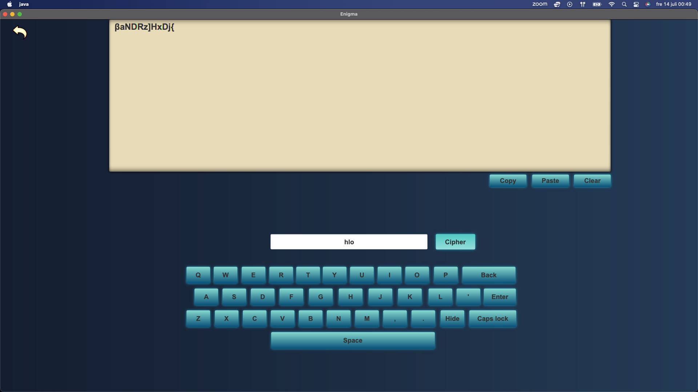

# Enigma
#### Video Demo:  <https://www.youtube.com/watch?v=V4_V_UlDn3o>
#### Description:

The Enigma Encryption System is a Java-based application that provides a secure and efficient method for encrypting and 
decrypting messages using various encryption algorithms. It offers a user-friendly interface for users to input their 
messages and generate encrypted outputs.

* Multiple encryption algorithm 
* User-friendly interface: The application provides an intuitive graphical user interface (GUI) that allows users to 
easily interact with the system. Users can input their messages, select encryption options, and view the encrypted outputs.
* Extensibility: The Enigma Encryption System is designed to be easily extensible. Additional encryption algorithms can
be integrated into the system with minimal effort, allowing for future expansion and customization.

### The main features of the Enigma Encryption System include:
#### 1. Sign Up and log in: 

The user needs to create an account in order to use the application. For the signup the user needs to provide a 
username, password and a secret code. The system does have error handling as well as validation. After that the user can
log in to the application.

#### 2. Main page:

The user has now multiple option to choose :

1. Trophies : 
The user is able to see if he/she has been able to achieve and unlock a trophy. Each trophy states what it needs to be
done in order to achieve it. This perhaps will provide a more fun and challenging experience for the user.

2. Cipher :
One of the main features of the application. The user can write a text in the board by typing or by the digital keyboard 
provided. The user needs to provide a key in order to encrypt the plain text. Then by clicking the cipher button the 
plain text will go through the multiple encryption algorithms and then the encrypted text will appear on the board. The
user can then copy and clear the board.

3. Decipher : 
The other main feature of the application where the user can either write on the board an encrypted text or paste the
copied text, and by providing the correct key when clicking the decipher button the plain text will appear on the board.

4. Current Keys : The user is able to see the current keys he/she has, when they were created and if he/she wants to 
delete the key, either because the key is not in use or since the user can not have two same keys. However, in order to
see the keys the user must provide the secret code. This is to strengthen the security. But the user can click the 
remember me in order to skip giving the secret code every time when visiting this page.

5. Account : The users can see their account where they are able to change their password or the secret code. The 
system does have error handling as well as validation.

## Installation and Usage

1. Clone the project repository from GitHub.
2. Open the project in your preferred Java development environment.
3. Build the project to resolve dependencies and compile the source code.
4. Run the application and follow the on-screen instructions.

## Contact

* For any inquiries or support, please contact me at 00mojali.afg@gmail.com

   